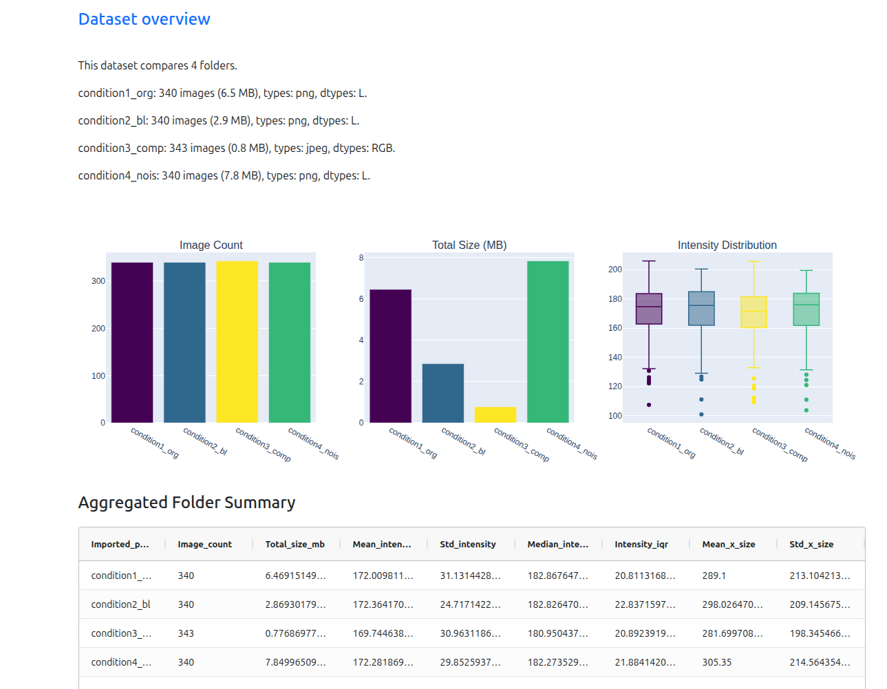
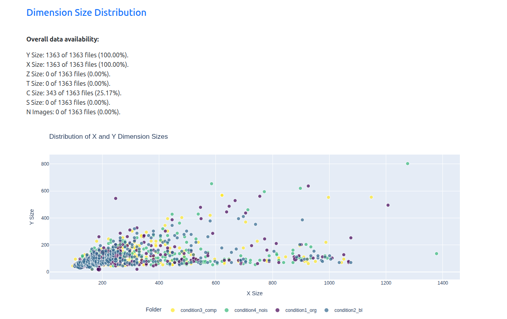
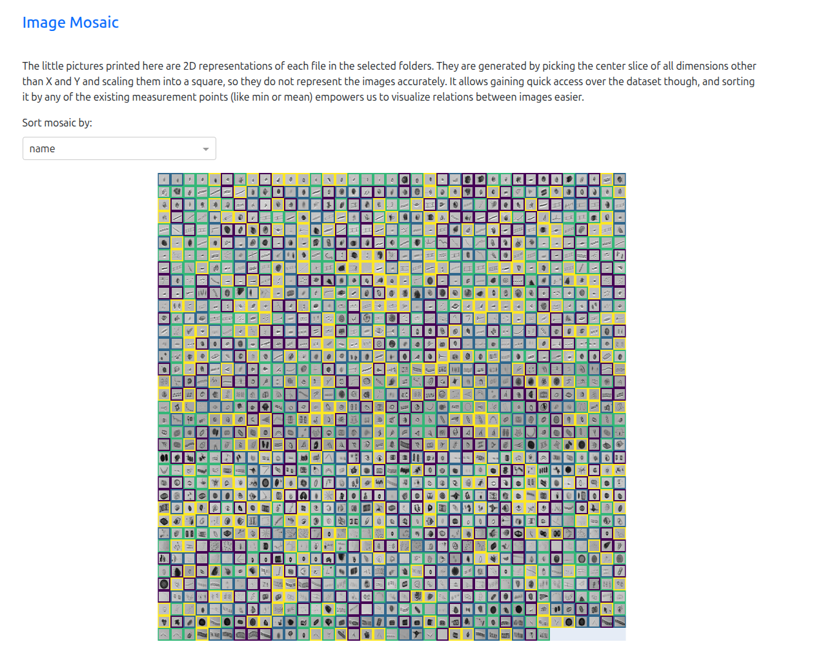
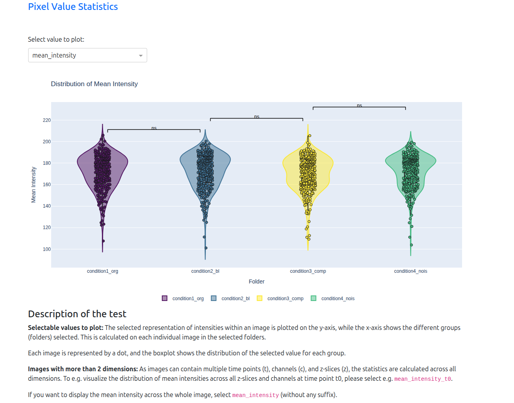

# PixelPatrol: Scientific Dataset Quality Control and Data Exploration Tool

PixelPatrol is an early-version tool designed for the systematic validation of scientific image datasets. It helps researchers proactively assess their data before engaging in computationally intensive analysis, ensuring the quality and integrity of datasets for reliable downstream analysis.


*PixelPatrol's main dashboard provides an interface for dataset exploration.*

## Features

* **Dataset-wide Visualization and Interactive Exploration**
* **Detailed Statistical Summaries**: Generates plots and distributions covering image dimensions.
* **Early Identification of Issues**: Helps in finding outliers and identifying potential issues, discrepancies, or unexpected characteristics, including those related to metadata and acquisition parameters.
* **Interactive Project Set-Up**: A user-friendly visual interface to configure your project.
* **Dashboard Report**: Interactive reports are served as a web application using Dash.
* **Interactive comparison across experimental conditions** or other user defined metrics.

### Coming soon:

* **Big data support**: Efficiently handle large datasets with optimized data processing.
* **Support for more file formats**

## Installation

PixelPatrol requires Python 3.11 or higher.  

PixelPatrol and its add-on packages are published on PyPI: https://pypi.org/project/pixel-patrol/

### 1. Install `uv` (recommended)

`uv` provides fast virtualenv management and dependency resolution. Install it once and reuse it for all workflows.

* **🐧 macOS / Linux:**
  ```bash
  curl -Ls https://astral.sh/uv/install.sh | sh
  ```

* **🪟 Windows:**
  ```powershell
  powershell -ExecutionPolicy Bypass -c "irm https://astral.sh/uv/install.ps1 | iex"
  ```

After installation, restart your shell (if needed) and verify it works:

```bash
uv --version
```

If you prefer an alternative installation method, consult the official guide: https://docs.astral.sh/uv/getting-started/installation/

### 2. Install PixelPatrol

Before installing the package, activate a clean virtual environment so its dependencies stay isolated from other projects. Create one with your preferred tool:

* **🐧 macOS / Linux:**
```bash
uv venv --python 3.12 pixel-patrol-env
source pixel-patrol-env/bin/activate
```

* **🪟 Windows PowerShell:**
```bash
uv venv --python 3.12 pixel-patrol-env
pixel-patrol-env\\Scripts\\Activate.ps1
```

#### Option A - Default - Full `pixel-patrol` Bundle

This is the quickest path to running Pixel Patrol with everything ready to go. Install it and you get the CLI plus the standard widgets, processors, and loaders.

Works the same on macOS, Windows (PowerShell), and Linux terminals:

```bash
uv pip install pixel-patrol
pixel-patrol --help
```

The first command downloads the latest release and adds `pixel-patrol` to your PATH; the second command confirms it’s ready.

#### Option B — Build your own stack (`pixel-patrol-base` + add-ons)

Advanced users may prefer to assemble only the components they need:

```bash
uv pip install pixel-patrol-base
```

Add functionality by layering optional packages:

* `pixel-patrol-image` – extra processors and widgets for image analysis.
* `pixel-patrol-loader-bio` – Adds the loaders Bioio and Zarr.

You can also add your own packages to add loaders, processors, and widgets to PixelPatrol.   
See `examples/minimal-extension` for a minimal template.

## Getting Started

1. Install PixelPatrol (Instructions are in the previous section).
2. Have all the files you would like to inspect under a common base directory.
3. You can also specify subdirectory within the base directory - only those directories will be processed.
4. Process your data - choose your way:  
   * Visual Interface: Run `pixel-patrol dashboard` to configure and process your data using a web interface.
   * OR use command Line:** Run `pixel-patrol export` via the CLI for automated or batch processing.
   * OR use the Pixel-Patrol API.
5. Explore the interactive dashboard in your browser.

## Example visualizations

* Visualize the distribution of image sizes within your dataset.*
        
* A mosaic view can quickly highlight inconsistencies across images.*
        
* Many additional plots and distributions are available.*
        


## Interactive Processing Dashboard

For users who prefer a visual interface over command-line arguments, PixelPatrol includes the Processing Dashboard.  
This will open a web browser tab that allows you to quickly and interactively configure your project.

To launch it, open your terminal (activate the env) and run:

```bash
pixel-patrol launch
```

## Command-Line Interface

With the CLI you can use all of pixel-patrol Python API building blocks by calling two commands one after the other.       
1. First run `pixel-patrol export` to create a pixel-patrol project and saving it as a ZIP file.   
2. Then pass that ZIP to `pixel-patrol report` when you want to explore the generated report in the dashboard.

### Common commands

```bash
pixel-patrol --help
pixel-patrol export --help
pixel-patrol report --help
```

### `pixel-patrol export`

Processes a directory tree, applies the selected loader and settings, and saves a portable ZIP archive.

```bash
pixel-patrol export <BASE_DIRECTORY> -o <OUTPUT_ZIP> [OPTIONS]
```

Key options:

* `BASE_DIRECTORY` – the root folder that contains your dataset. Use an absolute path or a path relative to your current working directory.
* `-o, --output-zip PATH` **(required)** – where to store the generated pixel-patrol project zip.
* `--name TEXT` – give your pixel-patrol project a name (defaults to the folder name).
* `-p, --paths PATH` – Optional. Subdirectories or absolute paths to treat as experimental conditions; use multiple `-p` flags for multiple paths. When you pass a relative path it is resolved against `BASE_DIRECTORY`. If omitted, everything under `BASE_DIRECTORY` is processed as a single condition.
* `-l, --loader TEXT` – Optional but recommended. Loader plug-in (e.g. `bioio`, `zarr`). If omitted pixel-patrol only shows basic file info.  
* `-e, --file-extension EXT` – Optional. One or more file extensions to include (meaning filter for). When unspecified the loader’s supported extensions (or `all` for no loader) are used.
* `--cmap NAME` – Optional Matplotlib colormap for visualizations (`rainbow` by default).
* `--flavor TEXT` – optional label shown next to the Pixel Patrol title inside the report.

Example (BioIO loader, two conditions to compare - by specifying the path to their directories, only processing file extensions tif and png:

```bash
pixel-patrol export examples/datasets/bioio -o examples/out/test_project.zip \
  --loader bioio --name "test_project" -p tifs -p pngs \
  -e tif -e png --cmap viridis
```

### Intermediate chunk files and resuming

When processing very large datasets, PixelPatrol can write intermediate Polars/Parquet chunk files so long runs can be resumed and do not have to be re-run from scratch. Behavior:

- By default the CLI `export` command will create an adjacent chunk directory next to the requested ZIP output: `<output_parent>/<output_stem>_records_chunks/` and write `records_batch_*.parquet` files there as processing progresses.
- The CLI will *not* clear that directory by default — this enables resume behavior: if you re-run `export` without the `--rerun-incomplete` flag, PixelPatrol will detect existing chunk files and skip already-processed images.
- If you want a fresh run (delete partial chunks first), pass `--rerun-incomplete` to `export` and the chunk directory will be cleared prior to processing.
- You can also explicitly select a chunk directory with `--chunk-dir <DIR>` to override the default location.

API users: `process_files()` (i.e. `Project.process_records`) will automatically infer a default `records_flush_dir` inside the project's `base_dir` when none is provided, so you do not need to set it explicitly to get intermediate chunk files. If you prefer a specific location, set `project.settings.records_flush_dir` (and optionally `processing_batch_size` / `records_flush_every_n`) before calling `process_files()`. The `export_project()` helper will still infer a default chunk directory next to the destination ZIP if that path is used.

Examples:

- Resume run (no clearing):

```bash
pixel-patrol export <BASE_DIR> -o out/my_project.zip
```

- Force clean re-run (clear partials first):

```bash
pixel-patrol export <BASE_DIR> -o out/my_project.zip --rerun-incomplete
```

- Explicit chunk directory:

```bash
pixel-patrol export <BASE_DIR> -o out/my_project.zip --chunk-dir /data/pp_chunks
```

### `pixel-patrol report`

Launches the Dash dashboard from a previously exported project ZIP file. The command prints the URL and attempts to open the browser automatically.

```bash
pixel-patrol report <REPORT_ZIP> [OPTIONS]
```

If the default port is unavailable, supply `--port 8051` (or any free port). The command can be rerun at any time; the ZIP file is never modified.  
Always run `export` before `report`; the exported ZIP is the on-disk representation of a Pixel Patrol project.


#### Example with custom global grouping and filters:
```bash
pixel-patrol report examples/out/quickstart_project.zip \
--group-by size_readable \
--filter-col file_extension \
--filter-op in \
--filter "tif, png"
--dim z=1 --dim t=0
```

#### For all filtering options, see:
```bash
pixel-patrol report --help
```

### Troubleshooting

* The CLI validates loader names at runtime; if you see `Unknown loader`, ensure the corresponding plug-in package is installed and available in the active environment.

## API Use

The `examples/` directory demonstrates how to use pixel-patrol API and for advanced users also how to extend pixel-patrol (loaders, processors, and widgets) by creating a package.

* `examples/01_quickstart.py` – end-to-end walkthrough using the base API. Process the bundled sample data and launch the dashboard:
  ```bash
  uv run examples/01_quickstart.py
  ```
  The script highlights each API step (create project → add paths → configure settings → process → show → export/import).
  Feel free to adapt the scripts to your datasets and needed settings.  

* `examples/02_example_plankton_bioio.py` – downloads an open plankton dataset (≈200MB), processes it with the BioIO loader, and exports a ready-to-share report. Run it with:
  ```bash
  uv run examples/02_example_plankton_bioio.py
  ```

* `examples/minimal-extension/` – For people who want to extend pixel-patrol, it offers an example minimal plug-in package that registers a custom loader (`markdown-diary`), processor, and widgets.   
Use this as a starting point for your own plug-ins: update the `pyproject.toml` metadata (name, version, entry points) to match your project, replace the `MARKDOWN_DIARY` identifiers with your loader ID, and adjust the processor/widget code to emit the fields you care about. Entry points must be registered under `pixel_patrol.loader_plugins`, `pixel_patrol.processor_plugins`, or `pixel_patrol.widget_plugins` so Pixel Patrol can discover them automatically.
