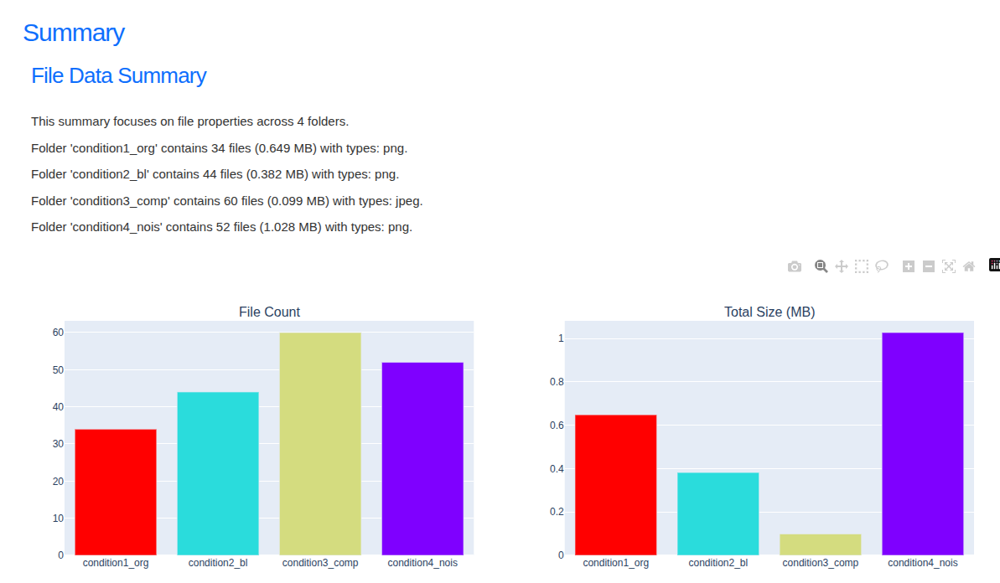
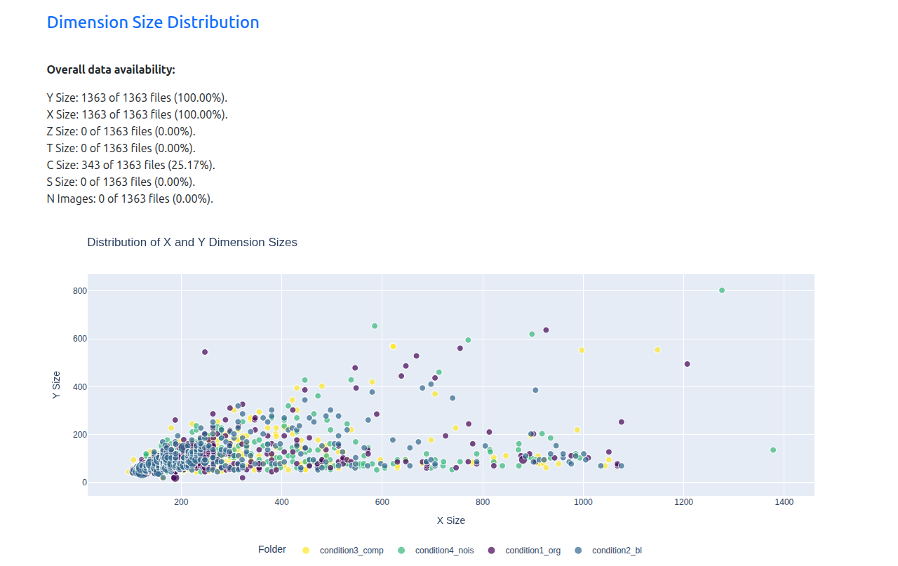
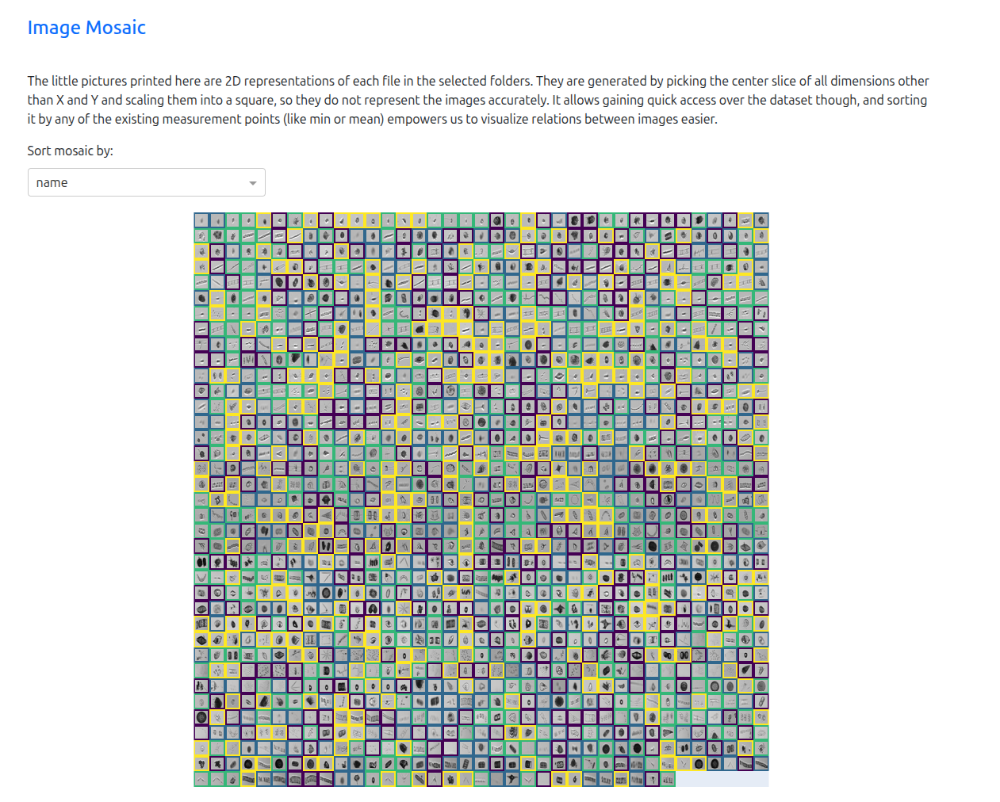
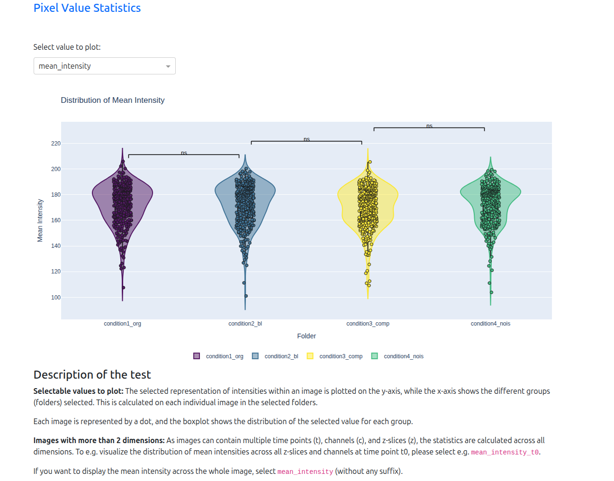

#   PixelPatrol 
### Scientific Dataset Quality Control and Data Exploration Tool

 

PixelPatrol is an early-version tool designed for the systematic validation of scientific image datasets. It helps researchers proactively assess their data before engaging in computationally intensive analysis, ensuring the quality and integrity of datasets for reliable downstream analysis.

   

*PixelPatrol's main viewer provides an interface for dataset exploration.*

## Features

* **Dataset-wide Visualization and Interactive Exploration**
* **Detailed Statistical Summaries**: Generates plots and distributions covering image dimensions.
* **Early Identification of Issues**: Helps in finding outliers and identifying potential issues, discrepancies, or unexpected characteristics, including those related to metadata and acquisition parameters.
* **Interactive Processing Dashboard**: A visual web interface to configure and launch processing (`pixel-patrol launch`).
* **Interactive Viewer**: Reports open as a fast static web app served locally — or deploy to GitHub Pages / any static host for sharing without a running server.
* **Interactive comparison across experimental conditions** or other user defined metrics.

### Coming soon:

* **Big(ger) data support**: While processing already runs in parallel, we're working on handling bigger and bigger datasets and GPU support.
* **Support for more file formats**

## Installation

PixelPatrol requires Python 3.11 or higher.  

PixelPatrol and its add-on packages are published on PyPI: https://pypi.org/project/pixel-patrol/

### 1. Install `uv` (recommended)

`uv` provides fast virtualenv management and dependency resolution. Install it once and reuse it for all workflows.

* **🐧 macOS / Linux:**
  ```bash
  curl -Ls https://astral.sh/uv/install.sh | sh
  ```

* **🪟 Windows:**
  ```powershell
  powershell -ExecutionPolicy Bypass -c "irm https://astral.sh/uv/install.ps1 | iex"
  ```

After installation, restart your shell (if needed) and verify it works:

```bash
uv --version
```

If you prefer an alternative installation method, consult the official guide: https://docs.astral.sh/uv/getting-started/installation/

### 2. Install PixelPatrol

Before installing the package, activate a clean virtual environment so its dependencies stay isolated from other projects. Create one with your preferred tool:

* **🐧 macOS / Linux:**
```bash
uv venv --python 3.12 pixel-patrol-env
source pixel-patrol-env/bin/activate
```

* **🪟 Windows PowerShell:**
```bash
uv venv --python 3.12 pixel-patrol-env
pixel-patrol-env\\Scripts\\Activate.ps1
```

#### Option A - Default - Full `pixel-patrol` Bundle

This is the quickest path to running Pixel Patrol with everything ready to go. Install it and you get the CLI plus the standard widgets, processors, and loaders.

Works the same on macOS, Windows (PowerShell), and Linux terminals:

```bash
uv pip install pixel-patrol
pixel-patrol --help
```

The first command downloads the latest release and adds `pixel-patrol` to your PATH; the second command confirms it's ready.

#### Option B — Build your own stack (`pixel-patrol-base` + add-ons)

Advanced users may prefer to assemble only the components they need:

```bash
uv pip install pixel-patrol-base
```

Add functionality by layering optional packages:

* `pixel-patrol-image` – extra processors and widgets for image analysis.
* `pixel-patrol-loader-bio` – Adds the loaders Bioio and Zarr.

You can also add your own packages to add loaders, processors, and widgets to PixelPatrol.   
See `examples/minimal-extension` for a minimal template.

## Getting Started

1. Install PixelPatrol (Instructions are in the previous section).
2. Have all the files you would like to inspect under a common base directory.
3. You can also specify subdirectories within the base directory — only those directories will be processed.
4. Process your data — choose your way:
   * **Visual Interface**: Run `pixel-patrol launch` to configure and launch processing via a web interface.
   * **Command Line**: Run `pixel-patrol process` to process your dataset and save a `.parquet` report file.
   * **Python API**: Use `api.process_files(project)` directly in a script.
5. Open the viewer: run `pixel-patrol view <report.parquet>` to explore your data interactively in the browser.

## Example visualizations

* Visualize the distribution of image sizes within your dataset.*
        
* A mosaic view can quickly highlight inconsistencies across images.*
        
* Many additional plots and distributions are available.*
        


## Interactive Processing Dashboard

For users who prefer a visual interface over command-line arguments, PixelPatrol includes the Processing Dashboard.  
This will open a web browser tab that allows you to quickly and interactively configure your project.

To launch it, open your terminal (activate the env) and run:

```bash
pixel-patrol launch
```

## Command-Line Interface

The typical two-step workflow:

1. Run `pixel-patrol process` to scan your dataset and write a `.parquet` report file.
2. Run `pixel-patrol view` to open that report in the interactive viewer.

### Common commands

```bash
pixel-patrol --help
pixel-patrol process --help
pixel-patrol view --help
```

### `pixel-patrol process`

Scans a directory tree, applies the selected loader and processors, and writes a `.parquet` report file.

```bash
pixel-patrol process <BASE_DIRECTORY> -o <OUTPUT.parquet> [OPTIONS]
```

Key options:

* `BASE_DIRECTORY` – the root folder that contains your dataset.
* `-o, --output PATH` **(required)** – where to save the generated `.parquet` report file.
* `--name TEXT` – project name (defaults to the folder name).
* `-p, --paths PATH` – Optional. Subdirectories to treat as experimental conditions; use multiple `-p` flags for multiple paths. Resolved relative to `BASE_DIRECTORY`. If omitted, everything under `BASE_DIRECTORY` is processed.
* `-l, --loader TEXT` – Optional but recommended. Loader plug-in (e.g. `bioio`, `zarr`). If omitted, only basic file info is collected.
* `-e, --file-extensions EXT` – Optional. File extensions to include (e.g. `tif`, `png`). Defaults to all extensions supported by the loader.
* `--flavor TEXT` – Optional label shown next to the Pixel Patrol title in the viewer.
* `--description TEXT` – Optional free-form description embedded in the report metadata.
* `--processors-include NAME` / `--processors-exclude NAME` – Run only specific processors or skip named ones.
* `--max-workers N` – Number of parallel Dask workers (default: CPU count).
* `--mb-per-task N` – Memory budget per task in MB (default: 512). Lower for very large images.
* `--max-images-per-task N` – Max images per task for both regular and container files (default: 200). Lower values give more frequent progress updates.
* `--log-file` – Write a debug log file alongside the output parquet.

Example (BioIO loader, two conditions, filtering to tif and png):

```bash
pixel-patrol process examples/datasets/bioio -o examples/out/my_report.parquet \
  --loader bioio --name "my_project" -p tifs -p pngs -e tif -e png
```

### `pixel-patrol view`

Opens a `.parquet` report in the interactive viewer. Starts a local HTTP server and opens the browser automatically.

```bash
pixel-patrol view <REPORT.parquet> [OPTIONS]
```

Key options:

* `--port N` – Port for the local server (default: 8052).
* `--no-browser` – Start the server without opening the browser.
* `--group-by COL` – Column to group by on first load.
* `--filter-col COL`, `--filter-op OP`, `--filter-val VAL` – Apply an initial filter (ops: `eq`, `in`, `gt`, `lt`, `contains`, …).
* `--dim KEY=VALUE` – Pre-select a dimension slice, e.g. `--dim z=1 --dim t=0`. Repeatable.
* `--widgets-exclude NAME` – Hide a viewer plugin by ID. Repeatable.
* `--palette NAME` – Color palette (default: `tab10`).

Example:

```bash
pixel-patrol view examples/out/my_report.parquet \
  --group-by file_extension \
  --filter-col dtype --filter-op eq --filter-val uint8 \
  --dim z=1 --dim t=0
```

### `pixel-patrol build-viewer-html`

Packages the viewer as a self-contained static file or a GitHub Pages–style site so you can share or host your report without running a server.

```bash
# Single self-contained HTML file (share alongside the .parquet):
pixel-patrol build-viewer-html -o viewer.html

# GitHub Pages / static host site folder:
pixel-patrol build-viewer-html -o gh-pages-out/
```

Open the HTML file directly in the browser, or deploy the site folder to any static host and load your report via a `?data=` URL pointing to the parquet.

### Troubleshooting

* The CLI validates loader names at runtime; if you see `Unknown loader`, ensure the corresponding plug-in package is installed and available in the active environment.

## API Use

The `examples/` directory demonstrates how to use the Pixel Patrol API and — for advanced users — how to extend it with custom loaders, processors, and widgets.

* `examples/01_quickstart_simple.py` – minimal end-to-end walkthrough: create a project, process files, open the viewer.
  ```bash
  cd examples && uv run 01_quickstart_simple.py
  ```

* `examples/02_quickstart_extended.py` – same flow with more configuration options demonstrated.

The core API steps:

```python
from pixel_patrol_base import api

project = api.create_project("my_project", base_dir="path/to/data", loader="bioio")
api.add_paths(project, ["condition_a", "condition_b"])  # optional
api.process_files(project, selected_file_extensions={"tif", "png"})
api.view(project)  # opens the viewer in the browser
```

* `examples/minimal-extension/` – complete plug-in package example: a custom loader (reads Markdown diary files), a custom processor (mood sentiment score), and two JavaScript viewer plugins (word frequency chart, mood trend chart). Use this as a starting point for your own plug-ins: update `pyproject.toml` metadata (name, version, entry points) and replace the example identifiers with your own. Python entry points are registered under `pixel_patrol.loader_plugins` and `pixel_patrol.processor_plugins`; viewer JS plugins are declared in `viewer/extension.json` and registered under `pixel_patrol.viewer_extensions`.
